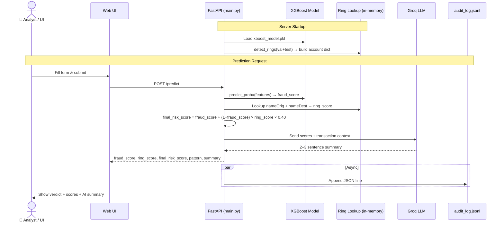

# SecurePay — Fraud Detection System

Real-time transaction fraud detection using XGBoost + graph-based ring analysis, served via FastAPI with AI explanations.

**Dataset:** [PaySim1](https://www.kaggle.com/datasets/ealaxi/paysim1) — 6.3M synthetic mobile-money transactions

---

## How It Works

Two signals combined into one final risk score:

1. **XGBoost model** — scores transaction behaviour (balance patterns, amount, recency, type)
2. **Graph ring detection** — finds fan-in hubs and layering chains in the transaction network
3. **Final score** = `fraud_score + (1 − fraud_score) × ring_score × 0.40`

---

## Performance

| Metric | Score |
|--------|-------|
| AUC-ROC | 99.92% |
| Recall @ 0.5 threshold | 99.92% |
| Precision @ 0.5 threshold | 53.70% |
| Training data | 6.3M transactions |

---

## Quick Start

```bash
# 1. Install
pip install -r requirements.txt
pip install langchain-groq

# 2. Add your Groq API key
echo "GROQ_API_KEY=your_key" > models/.env

# 3. Run
cd models
uvicorn main:app --reload --port 8000
```

> ⏳ First startup takes ~60s to build the ring-score lookup.

- UI → http://127.0.0.1:8000
- API docs → http://127.0.0.1:8000/docs

---

## Stack

XGBoost · NetworkX · FastAPI · Groq LLM · Pandas · Joblib

---

## High-Level Design



---

## Author

**Jayesh Vishwakarma** · [linkedin.com/in/cmd-jayesh](https://www.linkedin.com/in/cmd-jayesh)
