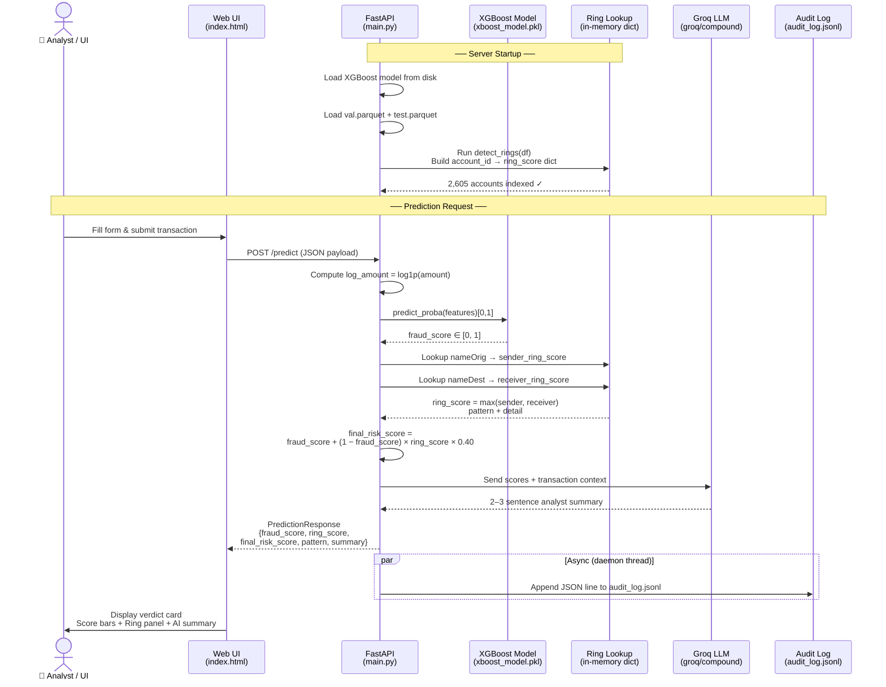

# SecurePay — Real-Time Fraud Detection System

> End-to-end ML system combining XGBoost transaction scoring with graph-based ring detection, served via FastAPI with AI-powered explanations.

**Dataset:** [PaySim1 on Kaggle](https://www.kaggle.com/datasets/ealaxi/paysim1) — 6.3M synthetic mobile-money transactions

---

## Table of Contents

1. [Project Overview](#project-overview)
2. [Key Features](#key-features)
3. [Performance Metrics](#performance-metrics)
4. [Tech Stack](#tech-stack)
5. [Project Structure](#project-structure)
6. [How It Works](#how-it-works)
   - [Data Pipeline](#data-pipeline)
   - [Feature Engineering](#feature-engineering)
   - [Model Training](#model-training)
   - [Graph Ring Detection](#graph-ring-detection)
   - [Combined Risk Score](#combined-risk-score)
   - [API & Audit Log](#api--audit-log)
7. [Quick Start](#quick-start)
8. [API Reference](#api-reference)
9. [Key Insights](#key-insights)
10. [High-Level Design](#high-level-design)
11. [Author](#author)

---

## Project Overview

SecurePay is a production-ready fraud detection system that analyses financial transactions using two complementary approaches:

- **XGBoost classifier** — scores individual transaction behaviour (balance draining, recency, amount patterns)
- **Graph ring detection** — analyses the transaction network to find fan-in clusters and layering chains (money-laundering structural patterns)

Both signals are combined into a single `final_risk_score` and explained in natural language via a Groq LLM.

---

## Key Features

- ⚡ Real-time fraud scoring with < 200ms API latency
- 🎯 99.92% recall — misses only 2 in 2,432 real fraud transactions
- 🔗 Graph-based ring & layering chain detection using NetworkX
- 🧠 AI-powered natural language explanations (Groq LLM)
- 📋 Append-only audit log (`audit_log.jsonl`) — every prediction logged with timestamp and all four scores
- 🌐 Interactive web UI with animated score bars and ring analysis panel
- 🔒 `.env`-based secret management, `.gitignore` enforced

---

## Performance Metrics

| Metric | Score |
|--------|-------|
| AUC-ROC | 99.92% |
| Recall (at threshold 0.5) | 99.92% |
| Precision (at threshold 0.5) | 53.70% |
| False Positive Rate | 46.30% |
| Training Data | 6.3M transactions |
| Fraud Rate in Dataset | 0.13% |
| Accounts flagged by ring detection | 2,605 |

> **Threshold note:** The model uses `0.8` as the fraud decision boundary (optimised for precision). Metrics above are reported at `0.5` for comparison.

---

## Tech Stack

| Layer | Technology |
|-------|-----------|
| ML Model | XGBoost Classifier |
| Graph Analysis | NetworkX |
| API Framework | FastAPI + Uvicorn |
| AI Explanations | Groq LLM (`groq/compound`) |
| Data Processing | Pandas, NumPy |
| Model Serialisation | Joblib |
| Secret Management | python-dotenv |
| Frontend | Vanilla HTML / CSS / JS |

---

## Project Structure

```
SecurePay/
│
├── train_lr.py                  # Model training script (XGBoost)
├── ring_detection.py            # Graph ring/layering detection — detect_rings(df)
├── combine_risk.py              # Joins fraud + ring scores → combined_risk.parquet
├── requirements.txt
├── README.md
├── audit_log.jsonl              # Append-only prediction audit log
│
├── preprocessing/
│   ├── prepare_data_1.py        # Step 1: CSV → Parquet (clean + dedupe)
│   ├── features_2.py            # Step 2: Feature engineering
│   ├── split_by_step_3.py       # Step 3: Time-based 70/15/15 split
│   └── see_parquet.py           # Debug utility
│
├── splitted_DS/
│   ├── val.parquet              # Validation split  (191,147 rows)
│   └── test.parquet             # Test split        ( 89,466 rows)
│
└── models/
    ├── main.py                  # FastAPI application — /predict endpoint
    ├── xboost_model.pkl         # Trained XGBoost model
    ├── .env                     # API keys (gitignored)
    └── static/
        └── index.html           # Web UI
```

---

## How It Works

### Data Pipeline

Three sequential preprocessing scripts produce the training data from the raw CSV:

```
fraud_detection.csv (6.3M rows)
        │
        ▼  prepare_data_1.py
  prepared_txn (Parquet)          ← deduped, sorted by step, clipped balances
        │
        ▼  features_2.py
  features.parquet                ← 15 engineered features added
        │
        ▼  split_by_step_3.py
  ┌─────┴──────┐
  train (70%)  val (15%)  test (15%)   ← time-based, no leakage
```

Splits are done on the `step` column (each step = 1 simulation hour), not randomly, so the model never sees future data during training.

---

### Feature Engineering

15 features extracted in `features_2.py`:

| Category | Features |
|----------|----------|
| **Raw amounts** | `amount`, `oldbalanceOrg`, `newbalanceOrig`, `oldbalanceDest`, `newbalanceDest` |
| **Engineered** | `log_amount`, `recency_hours`, `txn_count_24h`, `is_dest_new`, `hours_day` |
| **Transaction type (one-hot)** | `type_CASH_IN`, `type_CASH_OUT`, `type_DEBIT`, `type_PAYMENT`, `type_TRANSFER` |

---

### Model Training

**File:** `train_lr.py`

- **Algorithm:** `XGBClassifier`
- **Class imbalance:** `scale_pos_weight = negatives / positives` (~770×)
- **Hyperparameters:** `n_estimators=100`, `max_depth=6`, `learning_rate=0.1`
- **Decision threshold:** `0.8` (tuned for high precision over default 0.5)
- **Saved to:** `models/xboost_model.pkl`

---

### Graph Ring Detection

**File:** `ring_detection.py` — callable as `detect_rings(df)`

Builds a directed weighted graph where each account is a node and each transaction is an edge. Detects three structural fraud patterns:

| Pattern | Description | Score |
|---------|-------------|-------|
| **CYCLE** | Money loops back to origin (A→B→C→A) | Proportional to cycle length |
| **FAN_IN** | Many distinct senders funnel into one account | Normalised unique sender count |
| **LAYERING** | Sequential relay chains in TRANSFER/CASH_OUT (A→B→C, where B both receives and re-routes) | Absolute scale: 3-hop = 0.13, 10-hop = 1.0 |

Returns a DataFrame: `account_id`, `ring_score (0–1)`, `pattern`, `detail`

---

### Combined Risk Score

**File:** `combine_risk.py` / `models/main.py`

```
final_risk_score = fraud_score + (1 − fraud_score) × ring_score × 0.40
```

- Ring evidence can claim up to **40% of the remaining clean probability**
- High fraud_score transactions are barely affected — the model is already confident
- Borderline transactions with strong ring signals receive a meaningful boost
- Saved to `combined_risk.parquet` with all four scores per transaction

---

### API & Audit Log

**File:** `models/main.py` — FastAPI app

**Startup:** Ring lookup dict (`account_id → ring info`) is built once in memory from val + test parquets at server start (~60–90s).

**`POST /predict`** accepts a transaction JSON and returns:

```json
{
  "fraud_probability":    0.8314,
  "is_fraud":             true,
  "decision":             "FRAUD",
  "risk_level":           "HIGH",
  "sender_ring_score":    0.1429,
  "receiver_ring_score":  0.1429,
  "ring_score":           0.1429,
  "ring_pattern":         "LAYERING",
  "ring_detail":          "Layering chain participant (score=0.14)",
  "in_ring":              true,
  "final_risk_score":     0.841,
  "final_risk_level":     "HIGH",
  "summary":              "AI-generated analyst explanation..."
}
```

Every call appends one line to `audit_log.jsonl` via a background daemon thread (zero latency impact).

---

## Quick Start

**1. Clone and install**
```bash
git clone https://github.com/jayesh-cmd/Secure-Pay-Razorpay.git
cd Secure-Pay-Razorpay
pip install -r requirements.txt
pip install langchain-groq
```

**2. Set up environment variables**

Create `models/.env`:
```
GROQ_API_KEY=your_groq_api_key_here
```

**3. Start the server**
```bash
cd models
uvicorn main:app --reload --port 8000
```

> ⏳ Wait ~60–90 seconds for the startup message:
> `[startup] Ring lookup ready — 2,605 accounts indexed.`

**4. Open the UI**

- Web Interface: http://127.0.0.1:8000
- API Docs (Swagger): http://127.0.0.1:8000/docs

---

## API Reference

### `POST /predict`

**Request body:**

| Field | Type | Required | Description |
|-------|------|----------|-------------|
| `nameOrig` | string | No | Sender account ID (enables ring lookup) |
| `nameDest` | string | No | Receiver account ID (enables ring lookup) |
| `amount` | float | Yes | Transaction amount |
| `recency_hours` | float | Yes | Hours since sender's last transaction |
| `txn_count_24h` | int | Yes | Number of sender's transactions in last 24h |
| `is_dest_new` | int (0/1) | Yes | 1 if sender has never sent to this recipient before |
| `hours_day` | int (0–23) | Yes | Hour of day the transaction occurred |
| `oldbalanceOrg` | float | Yes | Sender balance before transaction |
| `newbalanceOrig` | float | Yes | Sender balance after transaction |
| `oldbalanceDest` | float | Yes | Receiver balance before transaction |
| `newbalanceDest` | float | Yes | Receiver balance after transaction |
| `type_CASH_IN` | int (0/1) | Yes | One-hot transaction type flags |
| `type_CASH_OUT` | int (0/1) | Yes | |
| `type_DEBIT` | int (0/1) | Yes | |
| `type_PAYMENT` | int (0/1) | Yes | |
| `type_TRANSFER` | int (0/1) | Yes | |

**Example — known fraud transaction:**
```json
{
  "nameOrig": "C1503476614", "nameDest": "C539633851",
  "amount": 181935.37, "recency_hours": 1000000,
  "txn_count_24h": 0, "is_dest_new": 1, "hours_day": 3,
  "oldbalanceOrg": 181935.37, "newbalanceOrig": 0.0,
  "oldbalanceDest": 0.0, "newbalanceDest": 0.0,
  "type_CASH_IN": 0, "type_CASH_OUT": 0, "type_DEBIT": 0,
  "type_PAYMENT": 0, "type_TRANSFER": 1
}
```

**Example — known legit transaction:**
```json
{
  "nameOrig": "C423543548", "nameDest": "M1490931456",
  "amount": 4200.0, "recency_hours": 48,
  "txn_count_24h": 0, "is_dest_new": 0, "hours_day": 9,
  "oldbalanceOrg": 18543.0, "newbalanceOrig": 14343.0,
  "oldbalanceDest": 0.0, "newbalanceDest": 0.0,
  "type_CASH_IN": 0, "type_CASH_OUT": 0, "type_DEBIT": 0,
  "type_PAYMENT": 1, "type_TRANSFER": 0
}
```

---

## Key Insights

1. **Account Draining** — Fraudsters drain the full origin balance to zero in a single TRANSFER
2. **New Destinations** — High-value transfers to first-time recipients are strongly predictive of fraud
3. **Transaction Type** — TRANSFER and CASH_OUT carry the highest fraud risk; PAYMENT is rarely fraudulent
4. **Layering Chains** — Money-laundering often routes funds through sequential relay accounts before cashing out
5. **Fan-In Hubs** — Accounts receiving money from many distinct senders are structurally suspicious even if no single transaction looks unusual

---

## High-Level Design



---

## Author

**Jayesh Vishwakarma**
- LinkedIn: [linkedin.com/in/cmd-jayesh](https://www.linkedin.com/in/cmd-jayesh)
- GitHub: [github.com/jayesh-cmd](https://github.com/jayesh-cmd)
